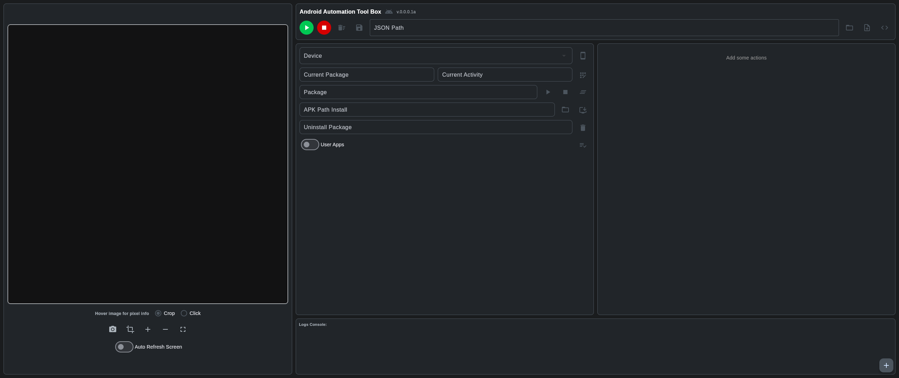

# Android Automation Tool Box

*   **Это кроссплатформенное графическое приложение на базе фреймворка Flet.**
*   **Разработанное для упрощения процесса автоматизации действий на Android-устройствах.**
*   **Инструмент позволяет визуально проектировать сценарии автоматизации (клики, свайпы, проверки активности, условные переходы, циклы).**
*   **И экспортировать их в готовые к исполнению скрипты на языке Python.**
  
  
  

---

## Архитектура проекта

Для корректной работы приложения в рабочей директории должны находиться следующие файлы:

```text
├── app.py                  # Файл приложения
├── funks.py                 # Модуль с функциями ADB
├── click_on_image.py        # Модуль поиска на изображениях (OpenCV)
├── theme.py                 # Файл конфигурации цветовой схемы и стилей
├── locales.py               # Словарь локализации интерфейса
├── requirements.txt         # Список внешних зависимостей
└── README.md                # Документация проекта
```
ADB должна быть установлена на компьютере и добавлена в системную переменную PATH.
На целевом Android-устройстве должен быть включен режим «Отладка по USB» (USB Debugging).

## Клонируйте репозиторий:
```
git clone https://github.com/Yangvarr/Android-Automation-Tool-Box.git
cd Android-Automation-Tool-Box
```
## Установите необходимые зависимости:
```
pip install -r requirements.txt
```
## Запустите приложение:
```
python app.py
```
